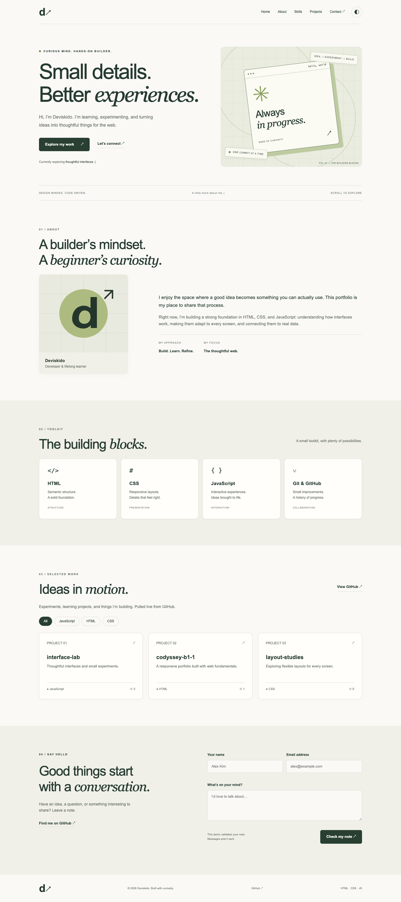

# Deviskido — Developer portfolio

A responsive portfolio built with semantic HTML, CSS, and vanilla JavaScript. It includes Hero, About, Skills, Projects, Contact, and Footer sections, with a green-and-cream visual style and an illustrated profile monogram.

Repository: https://github.com/Deviskido/codyssey-b1-1

Intended GitHub Pages URL: https://deviskido.github.io/codyssey-b1-1/ — deployment is pending; this URL has not been verified as serving this implementation.

## Run locally

Open this folder in VS Code, install the recommended **Live Server** extension, and choose **Open with Live Server** on `index.html`. The workspace config uses port 5500. VS Code/extension execution has not been verified in this environment.

Alternatively:

```sh
python3 -m http.server 5500 --bind 127.0.0.1
```

Visit http://127.0.0.1:5500. No build step or runtime dependencies are required. `requirements.txt` contains the assignment specification, not Python packages.

## Features and implementation

- Mobile-first layouts with breakpoints at 768px and 1024px; Flexbox navigation and auto-fit/minmax Grid project cards.
- Accessible navigation with a mobile menu, Escape handling, skip link, visible keyboard focus, and smooth anchor scrolling.
- Theme state updates CSS variables and localStorage (`portfolio-theme`). Without a saved setting, the theme follows the system preference. Disabled storage does not break the toggle.
- Navigation background changes at **60px** scroll; the back-to-top button appears at **300px**. Intersection Observer reveals sections at **threshold 0.2**. Reduced-motion settings disable smooth scrolling, reveals, and typing animation.
- GitHub projects are fetched from `https://api.github.com/users/Deviskido/repos?sort=updated&per_page=100`. Loading, success, error/retry, and empty states are rendered explicitly. Non-success HTTP responses (including 403) and a 12-second timeout show the error state. Unauthenticated requests are rate limited, so tests use fixtures instead of exhausting the API.
- Language filters derive from the repository data. API text is escaped and repository links are restricted to HTTPS GitHub URLs.
- Contact fields validate required values and email format on input/submission, display nearby errors, and focus the first invalid field. Successful validation displays a success message without reloading. **This demo does not send email.** Real delivery requires a Formspree/EmailJS account and endpoint.
- Three explicit event → state → rendering flows live in `js/main.js`: theme (`state.theme` → `renderTheme`), API/filter (`state.projectStatus`/`state.filter` → `renderProjects`), and form input (`state.errors` → field feedback).

The profile uses the repository owner's handle and an original SVG monogram. Edit `index.html` for your biography and replace `images/profile.svg` with a personal image if desired. Update the GitHub handle in `index.html` and `js/main.js` together.

## Verification

On 2026-09-10, the automated suite passed in installed Google Chrome **152.0.7977.83** against http://127.0.0.1:5500:

- Widths 375, 767, 768, 1023, 1024, and 1440px: no horizontal overflow and correct mobile menu visibility.
- Menu open/close/Escape, anchor navigation, 59/60px and 299/300px scroll boundaries, and return to top.
- Light/dark persistence across reloads and system theme changes without a saved preference.
- Empty/whitespace fields, malformed email, valid submission, and field error updates.
- Mocked API success, delayed loading, HTTP 403, network failure, retry recovery, empty response, filtering, and malicious text/URL escaping.
- Intersection Observer reveal, completed typing effect, and no uncaught page errors.

A separate live GitHub API request succeeded and returned five repositories. `node --check js/main.js` and `git diff --check` passed. The automated screenshots below use three deterministic fixture repositories; they are test data, not claims about the account's actual projects.

To reproduce browser checks, install Playwright as development tooling in a temporary directory, start the local server, and run:

```sh
npm install --prefix /private/tmp/portfolio-browser-check --no-audit --no-fund playwright
NODE_PATH=/private/tmp/portfolio-browser-check/node_modules node tests/browser.cjs
```

The suite uses installed Google Chrome; Playwright is not loaded by the website. See [KANBAN.md](KANBAN.md) for remaining checks.

## Screenshots

[Desktop](images/screenshots/desktop.png) · [Mobile](images/screenshots/mobile.png) · [Dark mode](images/screenshots/dark.png)



## Deploy

`.github/workflows/pages.yml` publishes the static website on pushes to `main` or a manual workflow run. In repository Settings → Pages, select **GitHub Actions** as the source. Authenticate GitHub with an account authorized for this repository, commit/push the files, and run the workflow. Then execute the deployment smoke checks in Kanban T21 and update the URL status above.

Deployment could not be performed because the available GitHub credentials are invalid. No changes have been pushed. Real email delivery is also pending external configuration.
